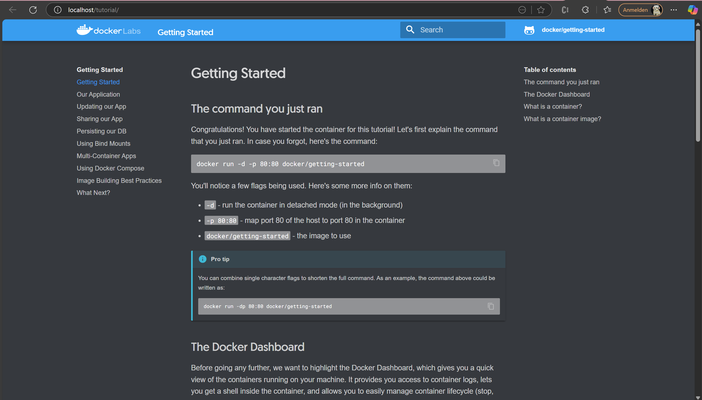
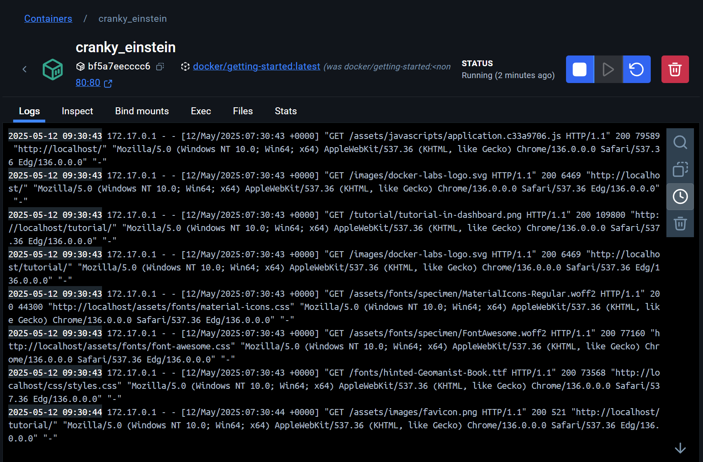
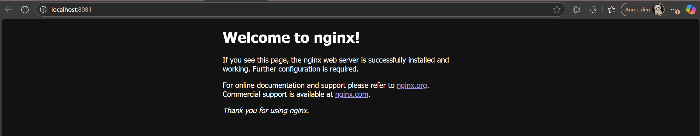

# KN01

## A) Installation

Screenshot der Webseite, nachdem Sie den ersten Container erstellt haben.

Screenshot der Containers in Docker Desktop, der Ihren Container zeigt.

## B) Docker Command Line Interface (CLI)

**4. In Teil A mussten Sie den Befehl docker run -d -p 80:80 docker/getting-started  ausführen. Erklären Sie die verschiedenen Parameter.**:

``docker run``: startet einen neuen container

``-d``: 'detached mode', der container läuft im hintergrund

``-p 80:80``: port mapping

``docker/getting-started``: name vom docker image

nginx homepage 

**5. Mit dem ubuntu Image verfahren Sie wie folgt. Wir zeigen, dass nicht jedes Image im Hintergrund ausgeführt werden kann.**
  **1. beim ausführen dieses befehls wurde das ubuntu-image automatisch aus docker hub heruntergeladen. der container startet im hintergrund, beendet sich jedoch sofort wieder, weil das ubuntu-image standardmäßig keinen dienst ausführt. es gibt also nichts, was „dauerhaft“ läuft. deshalb wird der container direkt gestoppt.**
  
  **2. dieser befehl öffnet eine interaktive konsole innerhalb des ubuntu-containers. man sieht eine shell ``(root@...:/#)`` und kann dort befehle wie ``ls`` oder ``pwd`` ausführen. erst wenn man ``exit`` eingibt, wird der container beendet. im gegensatz zum ``-d``-modus bleibt der container hier aktiv, solange man drin ist.** 
