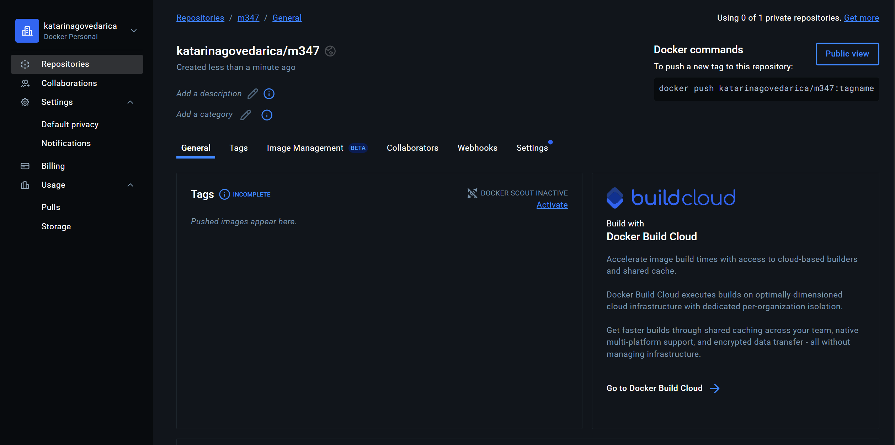

# KN01

## A) Installation

Screenshot der Webseite, nachdem Sie den ersten Container erstellt haben.

Screenshot der Containers in Docker Desktop, der Ihren Container zeigt.

## B) Docker Command Line Interface (CLI)

Alle Befehle: [Hier](Befehle-KN01.txt)

**4. In Teil A mussten Sie den Befehl docker run -d -p 80:80 docker/getting-started  ausführen. Erklären Sie die verschiedenen Parameter.**:

``docker run``: startet einen neuen container

``-d``: 'detached mode', der container läuft im hintergrund

``-p 80:80``: port mapping

``docker/getting-started``: name vom docker image

nginx homepage 

**5. Mit dem ubuntu Image verfahren Sie wie folgt. Wir zeigen, dass nicht jedes Image im Hintergrund ausgeführt werden kann.**

  **1. beim ausführen dieses befehls wurde das ubuntu-image automatisch aus docker hub heruntergeladen. der container startet im hintergrund, beendet sich jedoch sofort wieder, weil das ubuntu-image standardmäßig keinen dienst ausführt. es gibt also nichts, was „dauerhaft“ läuft. deshalb wird der container direkt gestoppt.**
  
  **2. dieser befehl öffnet eine interaktive konsole innerhalb des ubuntu-containers. man sieht eine shell ``(root@...:/#)`` und kann dort befehle wie ``ls`` oder ``pwd`` ausführen. erst wenn man ``exit`` eingibt, wird der container beendet. im gegensatz zum ``-d``-modus bleibt der container hier aktiv, solange man drin ist.** 

**6. Stellen Sie sicher, dass Ihr nginx-Container bereits läuft.  Öffnen Sie nun nachträglich eine interaktive Shell. Der Unterschied zu vorher ist, dass Sie nicht den Container mit interactiver Shell starten, sondern eine Shell eines laufenden Containers öffnen. Der Befehl ist docker exec -it <name-ihres-container> /bin/bash**

**1. Führen Sie den Befehl service nginx status aus. Erstellen sie einen Screenshot des Befehls und des Resultats. Sie sehen, dass Sie sich innerhalb des Docker-Images bewegen können.**

**7. Überprüfen Sie den Status der Container. Erstellen Sie einen Screenshot des Befehls und des Resultats.**

## C) Registry und Repository

Screenshot mit dem leeren Inhalt des neu erstellten Repository

## D) Privates Repository

Screenshot der Docker-Hub Seite mit den sichtbaren Tags Ihres Repos

Befehle, die Sie ausgeführt haben

1. docker pull nginx

2. docker tag nginx:latest katarinagovedarica/m347:nginx

3. docker push katarinagovedarica/m347:nginx

4. docker pull mariadb

5. docker tag mariadb:latest katarinagovedarica/m347:mariadb

6. docker push katarinagovedarica/m347:mariadb

Erklärung zu den Befehlen, die die einzelnen Komponenten beschreiben.

- `docker pull`: lädt ein öffentliches Image von Docker Hub herunter.
- `docker tag`: erstellt eine neue Bezeichnung (z. B. für eigenes Repo).
- `docker push`: lädt das Image ins eigene Docker-Hub-Repository hoch.
- Ein **Tag** ist wie eine Versionsnummer eines Images (z. B. `latest`, `1.0`).
