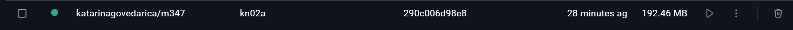
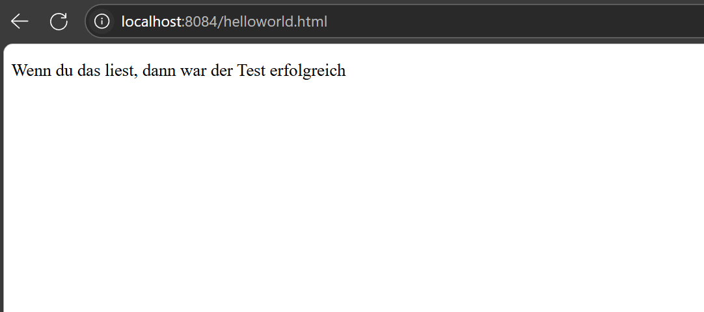
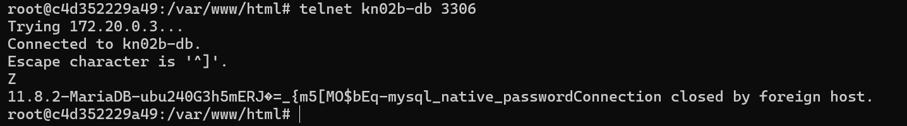
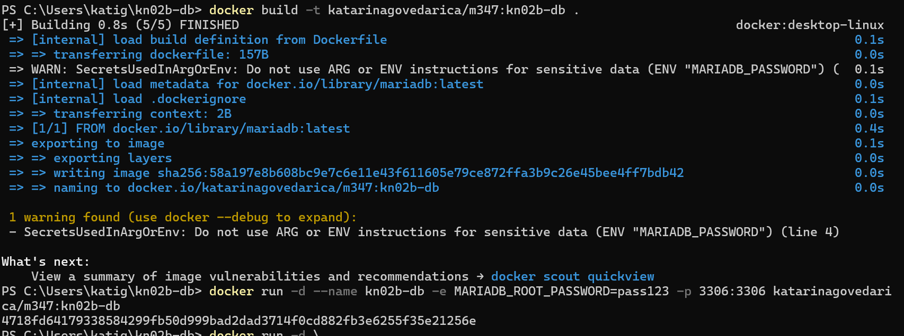
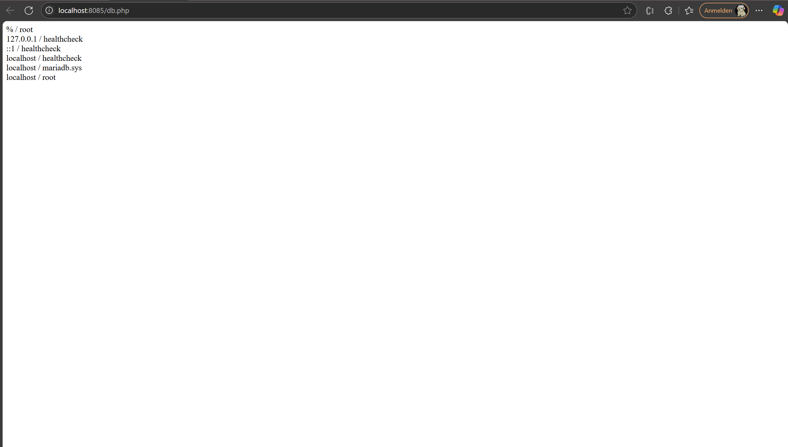
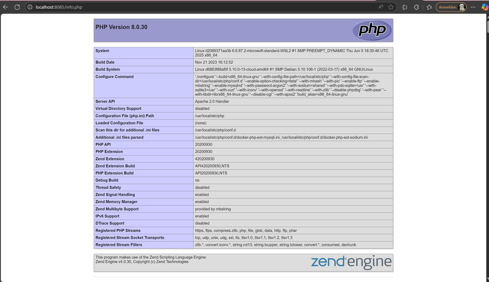
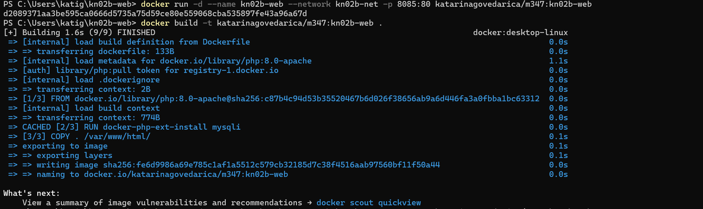

# KN02: DOCKERFILE

## A) Dockerfile I

Dokumentiertes [Dockerfile](Dockerfile), welches mit den entsprechenden Zeilen wie oben beschrieben.

Notwendige Docker-Befehle für das build. Es ist einfacher für den nächsten Schritt, wenn Sie bereits den korrekt Tag für Dockerhub verwenden mit Benutzername, etc.

``docker build -t katarinagovedarica/m347:kn02a .``

Notwendige Befehle für den Start des Containers und dem push in das private Repository (gemäss KN01)

``docker push katarinagovedarica/m347:kn02a
docker run -d -p 8084:80 katarinagovedarica/m347:kn02a``

Screenshot aus Docker Desktop, welcher das Image kn02a zeigt.

Screenshot der HTML-Seite, der die Seite helloworld.html zeigt, nachdem der Container gestartet wurde

## B) Dockerfile II

DB: telnet Befehl der zeigt, dass der Zugriff auf den DB Server funktioniert (Screenshot)

DB: Dockerfile für Ihren DB-Container

[Dockerfile](Dockerfile-db)

DB: docker build und docker run Befehle für Ihren DB-Container.

Web:  Screenshots der beiden Seiten info.php und db.php

Web: Dockerfile für Ihren Web-Container

[Dockerfile](Dockerfile-web)

Web: docker build und docker run Befehle für Ihren Web-Container.

Web: Angepasste PHP-Dateien

[db.php](db.php) & [info.php](info.php)
