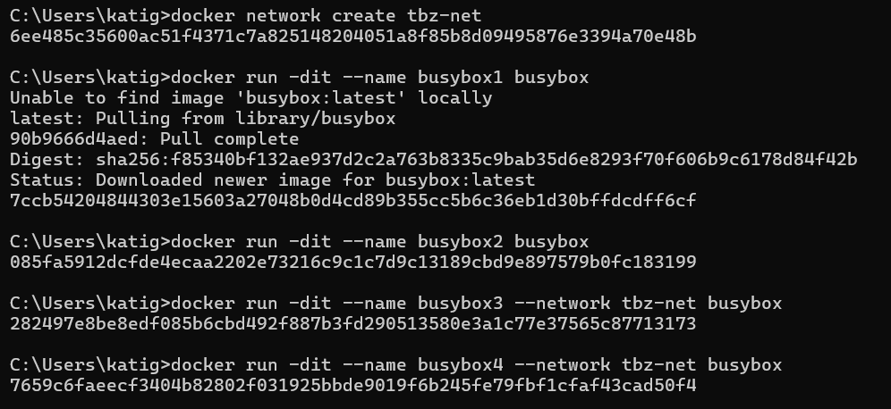
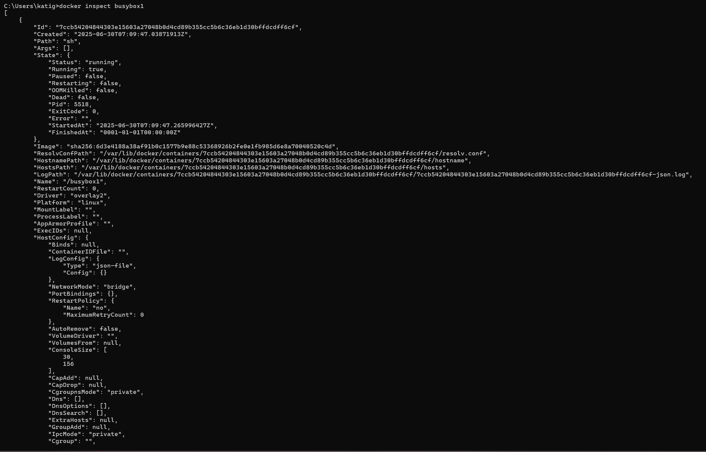
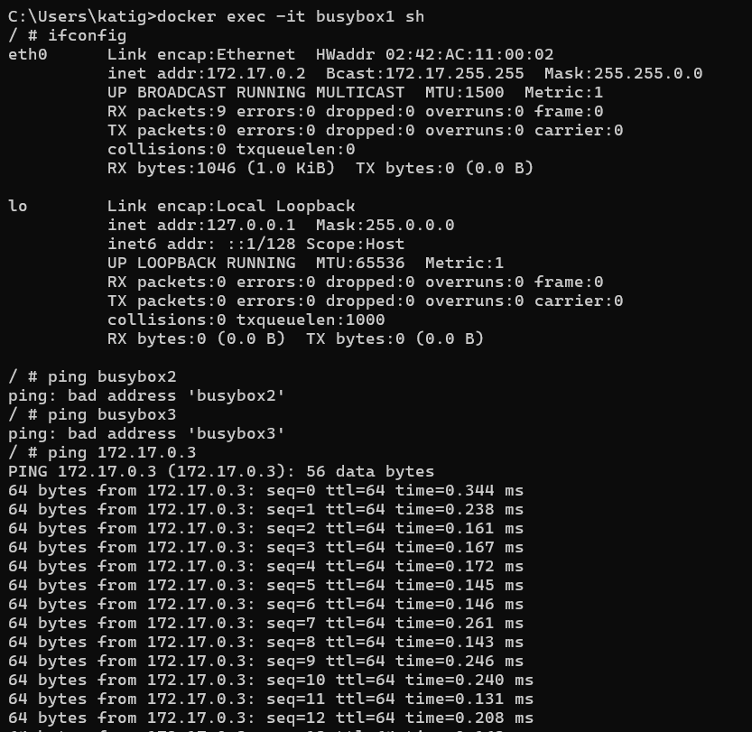
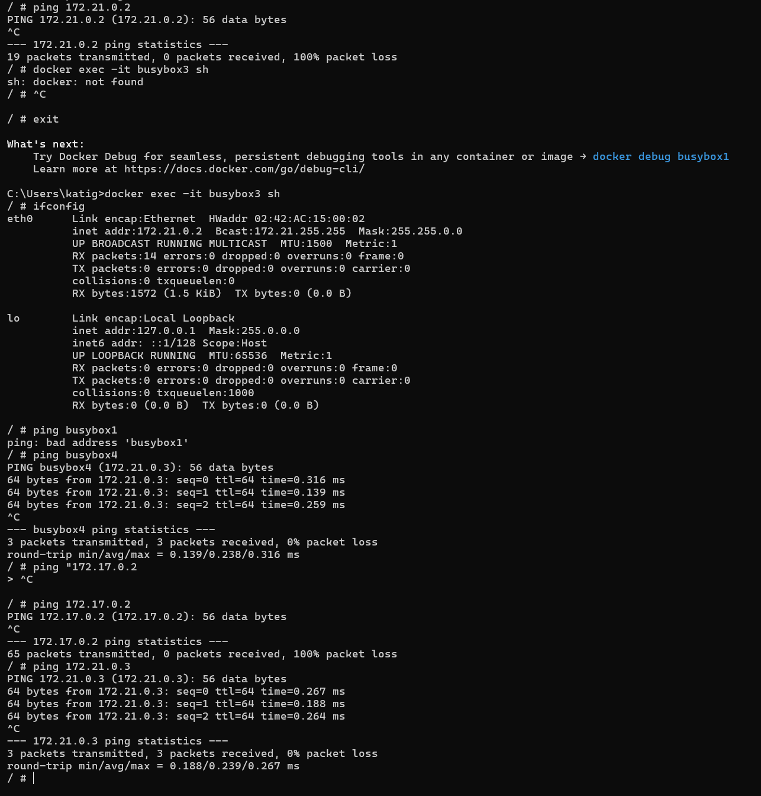

# KN03

## A) Eigenes Netzwerk

Screenshots der Befehle und deren Resultate. Achtung: Sie können Befehle zusammenfassen. Führen Sie die Befehle in einer sinnvollen Reihenfolge aus.

Build busyboxes and create the TBZ Net

Inspect the busybox

Interaktive Session

**Erklären Sie die Gemeinsamkeiten und Unterschiede. Wie kommen die Zustande und was ist Ihre Schlussfolgerung.**

***Gemeinsamkeiten***

- Alle Container (busybox1 bis 4) können über IP angesprochen werden.

- Container im selben Netzwerk (z. B. busybox3 und busybox4 in tbz) haben denselben Gateway.

***Unterschiede***

- Container im Default-Netzwerk (bridge) haben andere IP-Ranges (172.17.x.x) als im tbz-Netzwerk (172.18.x.x).

- Container in verschiedenen Netzwerken können sich nicht per Namen anpingen (busybox 3 von 1 aus geht nicht).

***zustand***

- Docker erstellt für jedes Netzwerk einen virtuellen "Switch".

- Container in einem Netzwerk hängen am gleichen virtuellen Switch, also können sie miteinander kommunizieren – per IP und Name.

- Container in verschiedenen Netzwerken sind wie in unterschiedlichen WLANs – nur Kommunikation per IP (wenn Routing erlaubt) möglich, nicht per Namen.

***schlussfolgerung***

Ob Container miteinander kommunizieren können, hängt davon ab, ob sie im gleichen Docker-Netzwerk sind.

**Betrachten Sie nun KN02.**

**In welchem Netzwerk befanden sich die beiden Container?**

Im kn02b-net

**Wieso konnten die miteinander reden?**

Container im selben Docker-Netzwerk können über ihre Containernamen miteinander kommunizieren, weil Docker einen internen DNS bereitstellt. sie teilen sich den selben subnetzbereich. und man hat den --network parameter am star angegeben (gibt an in welchem netzwerk der container laufen soll)
