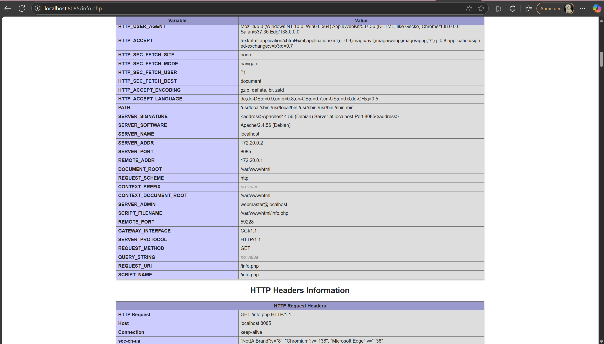
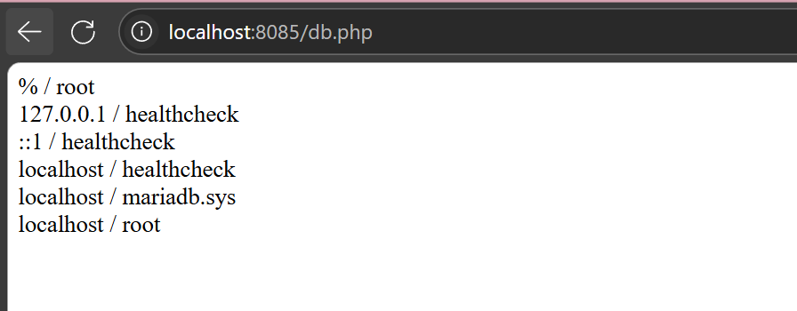

# KN04

## A) Docker Compose: Lokal

### Teil a

Screenshot der Seite info.php. Scrollen Sie dabei zuerst runter bis die Felder REMOTE_ADDR und SERVER_ADDR sichtbar sind

Screenshot der Seite db.php. Sie zeigen, dass beide Images im gleichen Netzwerk sind.

Docker-Compose File (yaml-Datei)

[Docker-Compose hier](docker-compose.yml)

Dockerfile für Webserver

[Dockerfile](Dockerfile-kn04)

**Liste der Befehle, die docker compose up ausführt und deren Erklärungen""

1. Netzwerk erstellen
   
Erstellt das definierte Netzwerk (wenn eins im YAML steht).

→ wie docker network create

2. Volumes erstellen (wenn nötig)
   
Erstellt Volumes, falls sie in der Datei definiert sind.

→ wie docker volume create

3.Image bauen (wenn build: im YAML steht)

Baut ein Image aus dem angegebenen Dockerfile.

→ wie docker build

4. Image herunterladen (wenn image: im YAML steht)
   
Lädt das Image von Docker Hub.

→ wie docker pull

5. Container starten
   
Startet alle Container laut Konfiguration.

→ wie docker run

6. Container ins Netzwerk einfügen
   
Fügt die Container ins definierte Netzwerk ein.

→ wie docker network connect

7.Logs anzeigen

Zeigt die Logs direkt im Terminal an.

→ wie docker logs

### Teil b

Screenshots der beiden Seiten
Docker Compose Datei (yaml)
Erklärung wieso der Fehler auftritt
